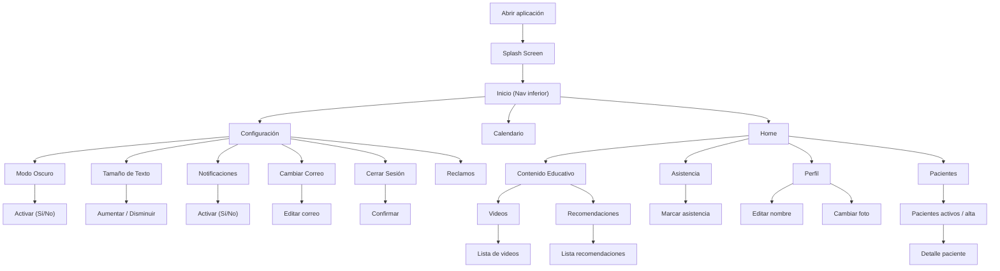

# Therafy
## Sobre el proyecto
*Tu agenda de sesiones en un solo lugar.*
Actualmente el área de la salud se está "adaptando" a la digitalización de los diferentes recursos, principalmente información que sigue un proceso riguroso, pero sin lograr esa facilidad en el manejo de los datos de los pacientes.

Therafy busca lograr que el proceso de terapias estén al alcance de la mano, teniendo mayor accesibilidad y rapidez a la hora de gestinoar cada proceso de cada paciente que se está atendiendo con el profesional de la salud.

## Instrucciones de uso
Una vez descargada la aplicación, la abrimos y nos mostrará la pantalla de inicio por defecto. En ella podemos acceder a cuatro secciones de la aplicación:
- Perfil
- Asistencia
- Contenido Educativo
- Pacientes

##### Perfil
Permite mostrar y modificar la información actual del usuario que usa la aplicación, como el nombre o la foto de perfil.

##### Asistencia
Pantalla para marcar la asistencia del usuario presionando un botón que registra el horario del momento (día y hora). También permite ver al usuario el historial de asistencias que ha tenido hasta la actualidad.

##### Contenido Educativo
Es un forma de llevar las terapias realizadas presencialmente para hacerlas de manera remota. Cuenta con videos guía y recomendaciones para tener en cuenta.

##### Pacientes
Es una pantalla que muestra todos los pacientes que se han atendido con el funcionario, activos y en alta, hasta la actualidad. Permite ver el detalle de cada paciente con su información asignada (nombre, edad, rut, estado, última sesión)

Todos los cambios que se realicen se verán reflejados en la pantalla de Calendario, a la cual se puede acceder con el navegador de barra inferior. Ahí podremos visualizar de mejor manera un 'resumen' de la agenda del funcioanrio o tareas por hacer. También por esta barra inferior de navegación, podemos acceder a la pantalla Configuración, para ver todo lo que sea el funcionamiento y preferencias en el uso de la aplicación, como el Modo Oscuro o enviar algún reclamo pertinente.

## ¿Por qué es necesaria?
- Falta de modernización digital en el funcionamiento del área de la salud
- Orden y gestión a la mano de las sesiones de cada usuario
- Nexo usuario-terapeuta
- Asistencia en segundos
- "Tele-trabajo" para los usuarios

## Características propias del móvil
Las funcionalidades que usará en cada dispositivo son:
- Notificaciones para recordar las sesiones
- Almacenamiento local para información del usuario
- Conexión a internet para sincronizar los datos

## Requerimientos
### Historias de usuarios
- "Me gustaría agendar las sesiones de acuerdo a cada paciente que atienda actualmente, diferenciando entre cada uno visualmente por dia".
- "Quisiera poder ver el detalle de mis pacientes, mostrando su información y si son activos o en alta".
- "Si se pudiera marcar la asistencia al trabajo de forma sencilla, sería ideal".
- "Estaría bueno un espacio que permita ver contenido que sirva de apoyo y aprendizaje respecto a la correcta ejecución de ejercicios o tareas estimulantes"

## Diagrama de Flujo

## Investigación
### Aplicaciones similares
#### Daylio y Moodfit
Aplicaciones que monitorean y apoyan el estado de ánimo del usuario, ayudando con su salud mental con una interfaz clara y sencilla.

### Diferencias con Therafy
Este proyecto se diferencia de las aplicaciones similares porque apoyaría a un sector en específico que son los profesionales de la salud, ya que la mayoría de las aplicaciones del estilo están enfocadas en el usuario y no hay una para este tipo de público que ayudan a que las personas mejoren su salud. Además que serviría como la app de apoyo ideal para cada institución que le permitiría manejar los datos al alcance de la mano.

### Tecnología usada
#### Flutter
Este fue el framework principal que se usó para desarrollar la aplicación.
